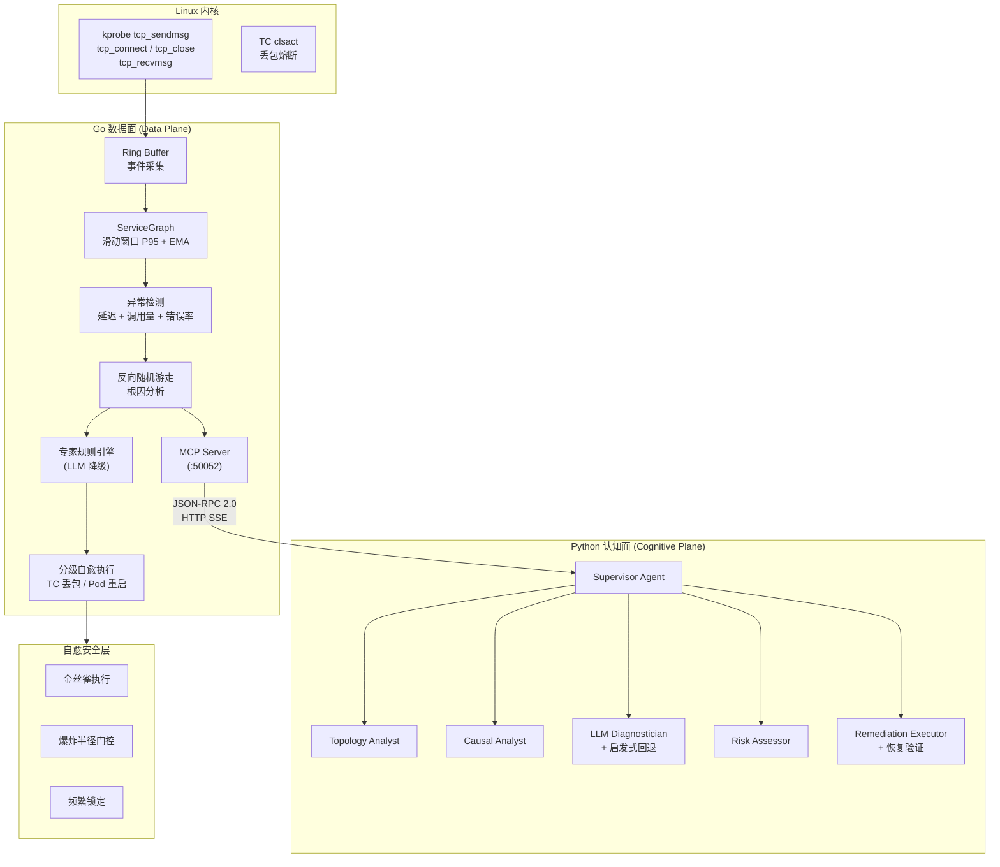

# AetherOps — eBPF + AI Multi-Agent + K8s 自愈

[](https://go.dev/)
[](https://python.org/)
[](https://ebpf.io/)
[](LICENSE)

基于 eBPF 内核探针的零侵入智能运维系统：**eBPF 采集 → AI 多 Agent 分析 → K8s 分级自愈**。

Go 数据面可脱离认知面独立运行，内置本地专家规则引擎作为 LLM 降级方案。

## 架构



## eBPF 探针矩阵

| 探针 | C 文件 | Hook 点 | 测量内容 | 适用场景 |
|------|--------|---------|----------|----------|
| **tracer** | `bpf/net_trace.c` | kprobe/kretprobe `tcp_sendmsg` | 内核缓冲拷贝时间 (µs) | 通用 TCP 流量拓扑 |
| **tcp_conntrack** | `bpf/tcp_conntrack.c` | kprobe `tcp_connect` + `tcp_close` | 连接生命周期 RTT | 短连接 (HTTP/1.0, DNS) |
| **tcp_rtt** | `bpf/tcp_rtt.c` | kprobe `tcp_sendmsg` + kretprobe `tcp_recvmsg` | 请求级往返延迟 | **长连接池** (MySQL, Redis, PgSQL) |
| **tc_drop** | `bpf/tc_drop.c` | TC clsact | 丢包 | 自愈熔断 |
| **http_probe** | `bpf/http_probe.c` | uprobe HTTP/gRPC handler | HTTP 请求耗时 + 状态码 | HTTP 服务细分 |
| **redis_trace** | `bpf/redis_trace.c` | kprobe `tcp_sendmsg` (6379 端口) | Redis 命令名 (GET/SET/MGET...) | Redis 协议发现 |
| **proto_classifier** | `bpf/proto_classifier.c` | kprobe `tcp_sendmsg` | 协议类型 (HTTP1/HTTP2/MySQL/Redis) | 自动协议识别 |
| **trace_context** | `bpf/trace_context.c` | kprobe `tcp_sendmsg` | W3C/Jaeger/Datadog TraceID/SpanID | 指标-拓扑-trace 三位一体 |

关键设计：
- `tcp_rtt.c` 用 `sk_ptr`（socket 指针）做 key，正确配同一 socket 的 send/recv，解决长连接 RTT 盲区
- 各探针独立 Ring Buffer，消费 goroutine 并行处理，互不阻塞
- RTT > 30s 的事件被丢弃（空闲 keep-alive 非真实请求）
- BPF verifier 约束：所有字符串比较展开为无循环字节匹配

## 核心能力

### 异常检测
- **三维异常评分**：延迟 (P95 偏离度) + 调用量 (QPS 突变) + 错误率
- **稳定基线**：EMA 平滑的 BaselineP95，仅在非异常窗口更新（BaselineGateMultiplier = 2.0）
- **反向随机游走**：从异常边沿拓扑反向传播，定位根因节点
- **故障聚类**：按节点+时间聚类异常模式

### 专家规则引擎（Go 本地，不依赖 LLM）

| 规则 | 检测条件 | 动作 |
|------|---------|------|
| cpu-throttle | 同节点所有出边 P95 同时升高，错误率 < 1% | SCALE_UP |
| conn-pool-exhaustion | 单条 DB 边高延迟+高错误，邻居边正常 | POD_RESTART |
| network-partition | 单节点所有边错误率 > 90% | TC_DROP |
| cascading-failure | 延迟沿拓扑链递增 | TC_DROP 隔离 |
| retry-storm | 调用量 > 3x 正常，延迟仅微增 | CONFIG_CHANGE |

降级链：LLM 诊断 → 本地专家规则 → 启发式 → "unknown"

### 自愈安全机制

| 机制 | 说明 |
|------|------|
| **金丝雀执行** | 先对 1 个 pod 执行 → 观察 30s → 异常分数下降才全量 |
| **爆炸半径门控** | 影响 > 20 服务 → 拒绝+升级人工；> 10 → 拒绝自动执行 |
| **频繁锁定** | 10 分钟内同一服务 3 次 → 锁定自动操作，强制人工介入 |
| **防抖冷却** | 同一节点自愈后 120s 冷却期 |
| **策略引擎** | OPA 风格 JSON 策略文件，deny/warn 双重效果 |
| **Dry Run** | 影子模式：全流程诊断+决策，不实际执行 |

### 自监控

- **组件健康检查**：30s 周期检查 8 个 eBPF 组件状态
- **19 个 Prometheus 指标**：业务指标 (edge_latency, anomaly_score, root_cause_score)、自监控 (ringbuf_events, ringbuf_dropped, decision_latency, component_health)、协议指标 (redis_commands, http_requests)
- **自适应采样**：异常检测触发时自动从 100ms 降至 10ms 采样间隔
- **结构化审计日志**：AuditEntry 记录动作/目标/评分/策略/专家规则/金丝雀结果/MTTR

## 快速启动

### 前置条件

- Linux 5.8+ (BPF CO-RE)，`libbpf` ≥ 1.0
- Go 1.24+
- Python 3.11+ (认知面可选)

### 数据面

```bash
# 编译 eBPF 绑定 + Go 二进制
make build

# 本地运行（模拟延迟模式）
sudo SIMULATE_LATENCY=1 ./ebpf-local

# 或直接编译运行
go generate ./cmd/tracer/...
go build -o ebpf-local ./cmd/tracer/
sudo EBPF_IFACE=eth0 DRY_RUN=1 ./ebpf-local
```

### 认知面（可选）

```bash
cd python
pip install --break-system-packages -e .
export LLM_PROVIDER=deepseek
export LLM_API_KEY=your-key
python -m aetherops.demo
```

### 完整部署（K8s）

```bash
# 部署数据面 DaemonSet + 认知面 Deployment
kubectl apply -f deploy/ebpf-tracer.yaml
kubectl apply -f deploy/aetherops-core.yaml

# 或使用安装脚本
bash deploy/aetherops-install.sh

# Helm
helm install aetherops deploy/helm/aetherops
```

### 非 K8s 部署

```bash
sudo bash deploy/nonk8s/install.sh
# 安装 systemd 服务：aetherops-tracer.service + aetherops-core.service
sudo systemctl start aetherops-tracer aetherops-core
```

## 配置

所有配置通过环境变量覆盖，前缀 `CFG_`。

| 变量 | 默认值 | 说明 |
|------|--------|------|
| `CFG_P95_MULTIPLIER` | 1.2 | 异常延迟阈值倍数 |
| `CFG_ANALYSIS_INTERVAL` | 15 | 分析间隔 (秒) |
| `CFG_MITIGATION_COOLDOWN_SEC` | 120 | 自愈冷却时间 (秒) |
| `CFG_MAX_SUSPECTS` | 5 | 最大嫌疑节点数 |
| `CFG_METRICS_ADDR` | :2112 | Prometheus 监听地址 |
| `CFG_MCP_ADDR` | :50052 | MCP 服务地址 |
| `CFG_TC_DROP_TTL` | 5 | TC drop 规则 TTL (分钟) |
| `CFG_HTTP_PROBE_TARGET` | /proc/self/exe | uprobe 目标二进制 |
| `DRY_RUN` | false | 影子模式开关 |
| `EBPF_IFACE` | ens33 | 网络接口名 |
| `POLICY_FILE` | (空) | 策略 JSON 文件路径 |

完整配置参考 [docs/configuration.md](docs/configuration.md)。

## 服务地址

| 服务 | 地址 | 说明 |
|------|------|------|
| MCP SSE | http://127.0.0.1:50052/sse | JSON-RPC 2.0 over SSE |
| MCP Message | http://127.0.0.1:50052/message | JSON-RPC 请求端点 |
| MCP Health | http://127.0.0.1:50052/healthz | MCP 健康检查 |
| Prometheus | http://127.0.0.1:2112/metrics | Prometheus 指标 |
| Health | http://127.0.0.1:2112/healthz | Agent 健康检查 |
| Grafana | http://127.0.0.1:3000 | (可选) 仪表盘 |

## MCP API

| 工具 | 说明 |
|------|------|
| `get_topology` | 获取当前服务拓扑（节点、边、异常分数） |
| `evaluate_remediation` | 评估自愈动作的爆炸半径和风险等级 |
| `execute_remediation` | 通过分级执行管线执行自愈动作 |
| `check_policy` | 检查动作是否符合策略规则 |
| `list_policies` | 列出所有活跃的策略规则 |

| 资源 | URI | 说明 |
|------|-----|------|
| Current Topology | `topology://current` | 实时拓扑快照 (JSON) |
| Anomaly Events | `topology://anomalies` | 近期异常事件流 |
| Policy Rules | `policy://rules` | 活跃策略规则列表 |

## Prometheus 核心指标

| 指标 | 类型 | 说明 |
|------|------|------|
| `ebpf_edge_latency_ms` | Histogram | 边调用延迟 |
| `ebpf_edge_anomaly_score` | Gauge | 边异常分数 |
| `ebpf_root_cause_score` | Gauge | 根因嫌疑分数 |
| `ebpf_ringbuf_events_total` | Counter | Ringbuf 事件量 (按 buffer) |
| `ebpf_decision_latency_ms` | Histogram | 事件到决策的端到端延迟 |
| `ebpf_agent_health` | Gauge | 组件健康状态 (1/0) |
| `ebpf_redis_commands_total` | Counter | Redis 命令量 (按命令) |
| `ebpf_http_requests_total` | Counter | HTTP 请求量 |

完整指标列表见 [docs/configuration.md](docs/configuration.md#prometheus-指标)。

## 项目结构

```
bpf/                        # eBPF C 探针
cmd/tracer/                 # Go 应用入口
internal/
  config/                   # 配置加载 (env → Config)
  detection/                # 异常检测 + 根因分析 + 专家规则
  errors/                   # 错误哨兵
  graph/                    # 服务拓扑图
  mcp/                      # MCP JSON-RPC 服务
  metrics/                  # Prometheus 指标注册
  remediation/              # 自愈执行 + 策略引擎 + 安全门控
  resolver/                 # 服务名解析 (PID → 进程名)
proto/                      # Protobuf 定义
python/
  src/aetherops/
    core/                   # MCP 客户端 + LLM Provider + 诊断
    workflows/              # Multi-Agent 工作流
deploy/                     # K8s manifests + Helm + 安装脚本
config/                     # Prometheus + Grafana 配置
docker/                     # Dockerfile
scripts/                    # 构建 + 混沌实验脚本
docs/                       # 文档
```

## 文档

| 文档 | 说明 |
|------|------|
| [docs/architecture.md](docs/architecture.md) | 系统架构详解 |
| [docs/ebpf-probes.md](docs/ebpf-probes.md) | eBPF 探针设计文档 |
| [docs/configuration.md](docs/configuration.md) | 配置参考 |
| [docs/deployment.md](docs/deployment.md) | 部署指南 |
| [docs/mcp-api.md](docs/mcp-api.md) | MCP API 参考 |
| [docs/development.md](docs/development.md) | 开发指南 |
| [docs/chaos-experiments.md](docs/chaos-experiments.md) | 混沌工程验证 |

## 分级自愈

| 风险 | 条件 | 执行方式 |
|------|------|---------|
| LOW | 影响范围小、错误预算充足 | 自动执行 |
| MEDIUM | 影响有限 | 通知 SRE，金丝雀执行 |
| HIGH | 多服务影响、错误预算高消耗 | 仅告警，需人工审批 |

## License

MIT
