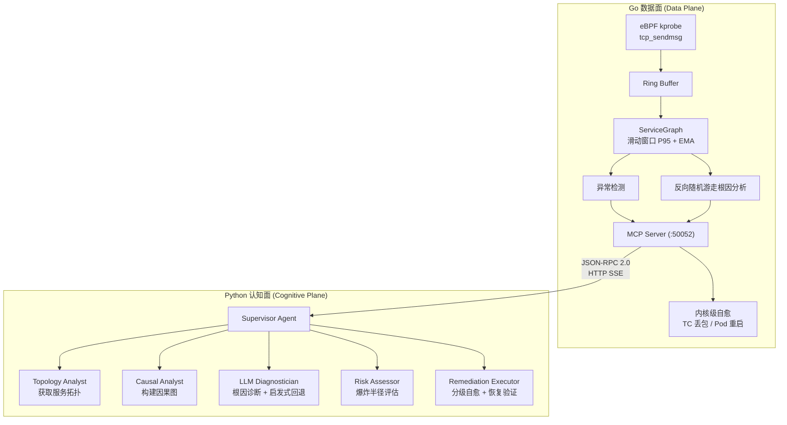

# AetherOps — eBPF + AI Multi-Agent + K8s 自愈

基于 eBPF 内核探针的智能运维系统：**eBPF 采集 → AI 多 Agent 分析 → K8s 分级自愈**。

## 技术栈

| 层 | 技术 |
|----|------|
| **内核** | eBPF kprobe, TC, CO-RE, Ring Buffer |
| **数据面** | Go 1.24, cilium/ebpf, Prometheus |
| **认知面** | Python 3.11, HTTPX |
| **AI** | OpenAI 协议兼容 (DeepSeek / Anthropic / Ollama) |
| **通信** | MCP 协议 (JSON-RPC 2.0 over HTTP SSE) |

## 架构



## 服务地址

| 服务 | 地址 |
|------|------|
| MCP 服务 | http://127.0.0.1:50052 |
| Prometheus | http://127.0.0.1:9090 |

## 快速启动

```bash
# 数据面（需 Linux 5.8+，eBPF 环境）
go generate ./cmd/tracer/...
go build -o ebpf-local ./cmd/tracer/
sudo SIMULATE_LATENCY=1 ./ebpf-local

# 认知面（另一终端）
cd aetherops
pip install --break-system-packages -e .
python -m aetherops.demo                # 交互式演示
python -m aetherops.main --workflow     # 单次工作流
```

## 项目结构

```
bpf/                     # eBPF C 探针
cmd/tracer/              # Go 入口
internal/                # Go 内部包
aetherops/               # Python 认知面
├── core/                # 核心模块
│   ├── mcp_client.py    # MCP 客户端
│   ├── llm_provider.py  # LLM 抽象层
│   ├── llm_diagnosis.py # LLM 诊断
│   ├── risk_client.py   # 风险评估
│   └── feedback.py      # 审批流
└── workflows/
    └── workflow.py      # 多 Agent 工作流
```

## 分级自愈

| 风险 | 条件 | 执行 |
|------|------|------|
| LOW | 小范围、错误预算充足 | 自动执行 |
| MEDIUM | 影响有限 | 通知 SRE，60s 无拒绝则执行 |
| HIGH | 多服务影响 | 只告警，需人工审批 |
