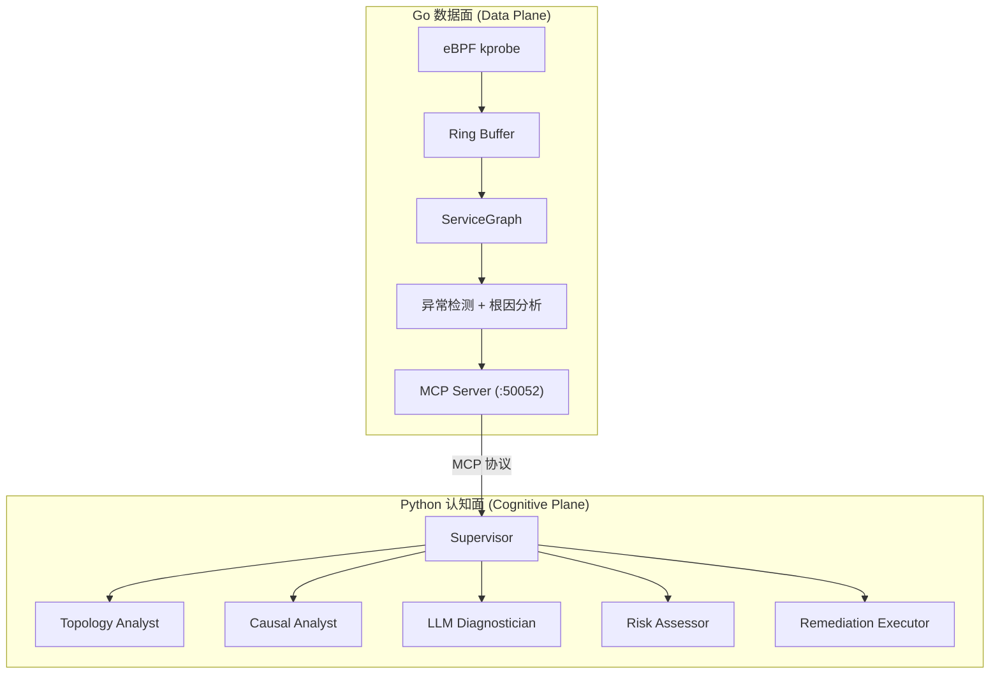

# AetherOps 项目简介

## 一句话

eBPF 采集内核 TCP 通信 → AI 多 Agent 分析故障根因 → K8s 分级自愈。

## 架构



**Go 数据面**：eBPF kprobe 零侵入捕获所有 TCP 通信 → ServiceGraph 实时拓扑 → 异常检测 + 反向随机游走根因分析 → 内核级自愈（TC 丢包/Pod 重启）。无外部依赖，仅内核 + K8s，可脱离认知面独立运行。

**Python 认知面**：Supervisor + 5 Expert Agents 工作流（Planner → Topology/Causal Analyst → LLM Diagnostician → Risk Assessor → Remediation Executor），通过 MCP 协议获取数据面拓扑。LOW 风险自动执行，HIGH 风险人工审批。执行后自动验证恢复 + MTTR 报告。

## 技术要点

| 层 | 要点 |
|----|------|
| **内核** | eBPF kprobe, TC, CO-RE, Ring Buffer |
| **数据面** | Go 1.24, cilium/ebpf, 滑动窗口 P95 + EMA, 反向随机游走 |
| **认知面** | Python, Supervisor + Multi-Agent, LLM 诊断（启发式回退） |
| **通信** | MCP 协议（JSON-RPC 2.0 over HTTP SSE） |
| **自愈** | LOW auto / MEDIUM confirm / HIGH pending + 恢复验证 |

## 快速启动

```bash
# 数据面
go build -o ebpf-local ./cmd/tracer/ && sudo SIMULATE_LATENCY=1 ./ebpf-local

# 认知面（另一终端）
cd aetherops && pip install --break-system-packages -e .
python -m aetherops.demo
```
